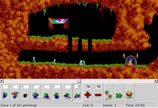
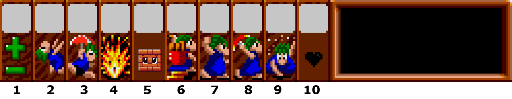

= Lemmings Game - Programmation Concurrente en multi-Threads

Projet de programmation dans le module Programmation Concurrente en multi-Threads, à l'université de Nantes.
Réalisé par Deransart Mattéo && Herlem Quentin, M1 ALMA.

Ce projet est codé en java, et utilise le framework d'application de développement de jeux **libGDX** .

=== Installer Gradle
Il est nécessaire de télécharger le fichier **gradle-8.4-bin.zip** à partir de https://gradle.org/releases/[] et de l'extraire dans le répertoire souhaité.

=== Executer le jeu
    RUN: ./gradlew run

== Le jeu

Lemmings est un jeu de réflexion sorti en 1991. Le joueur contrôle des mineurs qui doivent se frayer un chemin dans un labyrinthe souterrain rempli de pièges et d'obstacles.

Le joueur dirige sa cohorte de lemmings à l’aide des nombreuses commandes dont il dispose. Les créatures humanoïdes peuvent ainsi par exemple creuser, créer une chaîne, sauter en parachute, etc. +
Cependant, les aptitudes ne sont pas toutes permanentes. Certaines habiletés peuvent être attribuées de façon très limitée. Il est donc primordial de faire preuve de discernement, en choisissant au bon moment, l’action adéquate à mener.

## Les compétences
Les compétences sont les actions qu'un lemming peut effectuer pour atteindre son objectif dans les niveaux:
- Basher
- Bomber
- Builder
- Climber
- Excavator
- Floater
- Miner
- Walker (pas vraiment une compétence)

Les comportements sont spécifiés en haut des classes en question.

== Comment jouer ?

- 1: Appuyez avec le clique gauche sur le + ou accélérer le jeu et - pour le ralentir.
- 5: Affiche le nombre de briques disponible pour les builders
- 10: Affiche le nombre de lemmings en vie.
Appuyer sur le bouton avec clique gauche (zone en dessous des nombres) pour selectionner le skill:
- 2: Climber
- 3: Floater
- 4: Bomber
- 6: Builder
- 7: Basher
- 8: Miner
- 9: Excavator

Une fois un skill selectionné, cliquez sur un lemming à l'écran pour lui attribuer le skill.

== Descriptions des classes et méthodes

=== LemmingsManager:
La classe LemmingsManager est responsable de la gestion globale des Lemmings dans le jeu. + 
Elle coordonne l'arrivée, le déplacement et les actions des Lemmings tout au long du jeu. Voici un résumé de ses principales responsabilités :

==== Gestion des Lemmings :
- Ajout, déplacement et suppression des Lemmings dans le jeu.
- Organisation des Lemmings en attente d'entrer et ceux sur la carte.

==== Attribution des Compétences :
Permet d'attribuer des compétences spécifiques à certains Lemmings dans des zones définies.

==== Comptage des Lemmings :
Tient à jour le nombre de Lemmings vivants.

=== ResourceManager:
Cette classe assure la gestion sécurisée et partagée des ressources pour les lemmings, notamment les briques utilisées par les lemmings, permettant d'attribuer des briques de manière contrôlée, en tenant compte des demandes et des ajouts périodiques de nouvelles ressources.

==== Gestion des Briques :
- Maintient un compte du nombre total de briques disponibles.
- Ajoute périodique de nouvelles briques au stock avec un thread dédié.
- Limite le stock de briques à un maximum de 30.

==== Attribution des Briques :
- Permet aux Lemmings de demander une brique pour la construction.
- Le Lemming est placé dans une file d'attente pour la prochaine brique disponible.
- Si des briques sont disponibles, elles sont assignées au Lemming.

==== Méthodes de Contrôle des Ressources :
- Ajout de nouvelles briques au stock sous certaines conditions.

=== LevelManager:
Cette classe centralise la gestion des niveaux.

==== Gestion des Niveaux :
- Stocke et gère les différents niveaux du jeu.
- Gère les animations des portes de départ et d'arrivée pour chaque niveau.

==== Transitions entre Niveaux :
- Permet de passer au niveau suivant en actualisant ses caractéristiques.

==== Contrôle des Compétences :
- Gère les compétences disponibles pour chaque niveau et les décrémente après utilisation.

==== Vérification de la Fin du Niveau :
- Vérifie si un Lemming atteint les portes de sortie pour terminer le niveau.

L'Enum *Level* définit les différents niveaux du jeu avec leurs caractéristiques spécifiques.

=== Lemmings:
La classe Lemming représente les entités du jeu "Lemmings". Ces entités sont caractérisées par leur position, leur animation et leur compétence. +
Chaque lemming possède des propriétés telles que sa position sur l'écran, sa direction de déplacement, et des mécanismes pour gérer les collisions avec l'environnement.

La classe gère également les animations du lemming, définies par des séquences d'images. Elle contrôle la transition entre ces images pour animer les lemmings à l'écran.
Chaque lemming possède une compétence spécifique qui influence son comportement.

==== Skill:
La classe abstraite Skill représente les compétences disponibles pour les lemmings. +
Chaque compétence est associée à un comportement spécifique qu'un lemming peut adopter pour atteindre ses objectifs dans les niveaux du jeu.

Elle est conçue pour être héritée par des classes concrètes représentant des compétences spécifiques telles que le marcheur, le creuser, la constructeur ou d'autres compétences propres aux lemmings. +
Chaque sous-classe concrète de Skill implémente la méthode abstraite act() pour définir le comportement particulier de cette compétence.(appelée à chaque mise à jour du jeu pour définir l'action à effectuer par le lemming selon sa compétence) 

Nous ne présenterons pas dans le détails les classes implémentants les compétences, car elles sont très similaires. Les comportements sont décrit en haut de chaque classe en question.

=== Animation
La classe Animation gère les paramètres essentiels d'une animation dans le jeu. Elle stocke les indices des premiers et derniers sprites ou frames pour les animations de mouvement vers la droite et la gauche, détermine si l'animation doit boucler et définit les dimensions de la hitbox pour la détection des collisions.

=== SpriteSheetInfo
Cette classe stocke les informations relatives à une feuille de sprites. +
Il conserve la largeur et la hauteur d'un sprite, charge la texture associée à partir d'un fichier image, découpe cette image en régions correspondant à chaque sprite, et détermine le nombre de sprites en X (colonnes) et en Y (lignes).

=== Map :
La classe Map gère la représentation modifiable de la carte dans le jeu. 

==== Stockage de la Carte :

- Stocke la carte modifiable sous forme de Pixmap pour détecter les collisions avec les éléments du jeu.
- Dispose d'une version affichable de la carte via Texture.

==== Gestion des Collisions :

- Détecte les collisions avec le sol et le plafond grâce à des méthodes dédiées.
- Calcul de la hauteur nécessaire pour franchir un mur en mouvement vers la droite ou la gauche.

=== MyInputProc
Gestionnaire d'entrée pour le jeu, implémentant InputProcessor de LibGDX.

- Gère les actions de l'utilisateur via les interactions tactiles.
- Permet de sélectionner des compétences spécifiques en fonction de l'emplacement de l'écran touché.
- Contrôle la vitesse du jeu en fonction de la zone tactile sélectionnée.
- Associe des comportements spécifiques aux Lemmings en fonction de l'emplacement.

=== NumberRenderer
La classe NumberRenderer gère l'affichage des chiffres de 0 à 99 dans dix cases différentes. Elle utilise une feuille de texture pour les chiffres et calcule les positions de chaque chiffre dans les cases pour les afficher correctement.

=== Compteur :
La classe Compteur représente un compteur sans verrouillage.

==== Gestion du Compteur :

- Implémente un compteur atomique sans verrou pour les opérations d'incrémentation et de décrémentation.
- Gère l'incrémentation du compteur par unité.
- Gère la décrémentation du compteur par unité.
- Stocke la dernière valeur du compteur pour consultation ultérieure.
- Permet de reset le compteur.

=== LockFreeQueue
La classe LockFreeQueue représente une file d'attente conçue pour des opérations concurrentes sans utilisation de verrous.

==== Initialisation de la File d'Attente
Elle crée une nouvelle file d'attente lock-free à l'aide de deux références atomiques pour la tête et la queue.

==== Ajout dans la File d'Attente
La méthode offer permet d'ajouter un élément à la file d'attente. Elle gère les ajouts concurrents de manière sécurisée sans utiliser de verrous, garantissant ainsi un fonctionnement sans attente active.

==== Consultation de l'Élément en Tête :
La méthode peek permet de consulter l'élément en tête de la file sans le supprimer. Elle réalise cette opération de manière atomique, évitant ainsi les conflits entre threads.

==== Retrait de l'Élément en Tête :
La méthode poll récupère et supprime l'élément en tête de la file d'attente.

==== Vérification de la Présence d'un Élément :
La méthode contains vérifie la présence d'un élément spécifique dans la file d'attente. Elle parcourt la file de manière sécurisée, en vérifiant la valeur de chaque nœud pour déterminer si l'élément est présent.

Elle utilise une classe interne, Node, pour représenter chaque élément de la file. Cette classe Node contient une référence atomique vers le prochain nœud et stocke la valeur à insérer dans la file.

=== Game
La classe Game gère la logique principale de l'application libGDX. +
Elle contrôle le rendu graphique, la gestion des niveaux et des compétences des Lemmings, ainsi que la mise à jour du jeu. Cette classe centralise les mécanismes clés du jeu, incluant l'affichage graphique, la synchronisation des éléments du jeu, et la gestion du temps et des ressources.

D'autres classes sont présente mais il n'est pas nécessaires pour nous de les détailler ici.

== Les structures multi-threads implémentées

=== Les lemmings

Nous voulions des agents concurents pour notre jeu. Les lemmings ont ainsi ce rôle. +
Pour ce faire, nous avons une queue qui stocke de lemming appartenant au jeu. A chaque fois que nous ajoutons un lemming, nous lancons un thread qui va s'occuper de le mettre à jour tant qu'il est en vie.

=== Boucle while(true)
Nous ne voulons pas relancer nos thread à chaque tour de jeu. Pour contourner ce probleme, nous avons créer une boucle while(true) dans laquelle nos thread sont piégés.

Or nous voulons que nos threads soient synchronisés entre eux et en fonction du temps.
Nous nous servons d'une propriété de libgdx pour que les threads s'attendent bien. +
La bibliothèque appelle la fonction game::render() à chaque tick (tour). Nous nous servons de cette fonctionnalité pour réveiller à chaque tick tout nos threads. A chaque boucle, nos threads sont mis en wait(), puis sont réveillés par l'appel à la méthode LemmingManager::update() au bout d'un tick.
Donc chaque thread s'exécute bien une fois tout les ticks

Une deuxieme propriété que nous souhaitions est la possibilité d'arrêter un thread.
Pour ce faire, chaque thread vérifie si son lemming à été supprimé de la queue au début du tick. Si le lemming à été supprimé alors le thread s'arrête de lui même.

=== RessourceManager - File d'attente non-bloquante

Nous voulions que nos Lemmings accèdent à une ressource partagée. +
Les lemmings "builder", partagent un ensemble de briques. +
Lorsqu'un builder souhaite souhaite construire un pont, il demande à la ressourceManager si une brique est disponible pour lui. Il est mis dans une file d'attente et attend que la ressourceManager lui donne une brique.

=== Compteur lock free

La première version du RessourceManager utilisait un algorithme lock-free, et nous avons préféré utiliser une file non-bloquante pour réaliser le ResourceManager.

Pour montrer que nous savions utiliser les algorithmes lock-free, nous avons décidé de créer une classe compteur à la place.
Nous avons donc créer un compteur afin de connaitre le nombre de lemmings en vie.
Ce compteur est appellé par chaque lemmings en début de tick, et est réinitialisé à chaque nouvel update.

